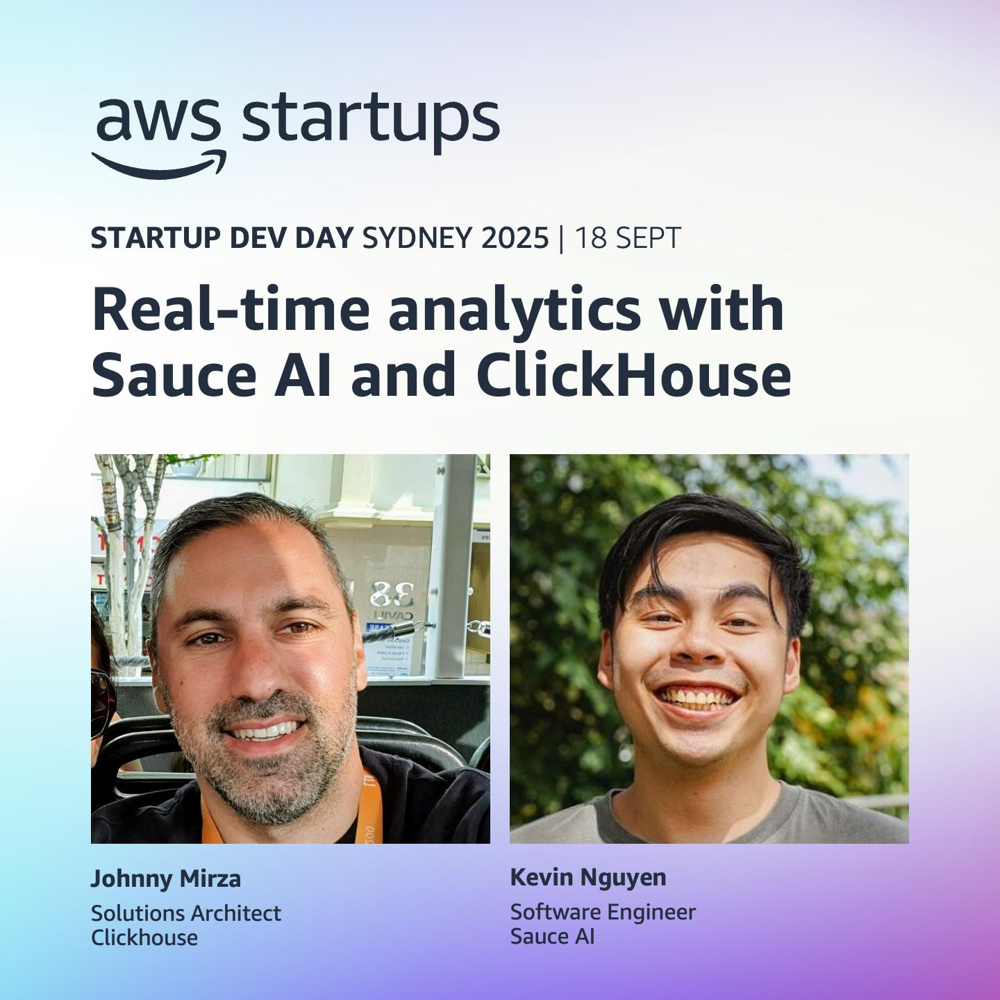

I ran the below script against the repo's I've been working on and asked Google Gemini 2.5/3.0 Pro to summarised what I've done.
```bash
git log --author="$(git config user.name)" --since="1 year ago" --name-status --pretty=format:"%h - %an, %ar : %s" > my_commits_last_year.txt
```
## Toolbox

| Scope                      | Tech                                                                                                                                                                                     |
| :------------------------- | :--------------------------------------------------------------------------------------------------------------------------------------------------------------------------------------- |
| **Frontend**               | React (incl. React 19), TypeScript, Next.js, Vite, Tailwind CSS, shadcn/ui, Apollo Client, MDX, Web Extensions (WXT)                                                                     |
| **Backend**                | Node.js, Bun, Python, TypeScript, Postgres (OLTP), ClickHouse (OLAP), Redis, GraphQL, Prisma, Drizzle ORM, BullMQ, Effect                                                               |
| **Cloud & Infrastructure** | **AWS:** ECS, ECR, RDS, ElastiCache, SQS, CloudFront, Route 53, S3, WAF, PrivateLink, IAM<br/>**IaC:** AWS CDK, Docker, Serverless<br/>**Orchestration:** Kubernetes (EKS), Karpenter                |
| **AI & Data**              | **LLM Services:** Anthropic Claude, Google Gemini, Extend AI, OpenAI API, AWS Bedrock<br/>**Techniques & Libraries:** OCR extraction, LLM evals, Clustering (HBDSCAN, K-Means), RAG, Dimension reduction (UMAP, PCA), Embedding (Tuning, Sentence-Transformers) |
| **Observability & DevOps** | OpenTelemetry, Grafana, CloudWatch, GitHub Actions, Nango                                                                                                                                |
| **Developer Tools**        | Nix, Vim, Tmux, Colima, Claude Code, Opencode                                                                                                                                                                   |

## Work experience

### Skip - Senior Product Engineer (Jan 2026 - Current)

#### **Credit Decisioning Engine**

- **Architected and implemented an Automated Credit Decisioning Engine** in TypeScript, comprising a highly extensible rule registry with Zod schema validation to evaluate loan applications across 27+ rules covering serviceability, income, housing, liabilities, identity, and credit file checks — outputting typed `PASS / FAIL / SKIP` outcomes for each.
- **Implemented a comprehensive suite of credit decision rules** spanning identity verification (`passportCheck`, `driverLicenceCheck`, `medicareCardCheck`, `birthCertificateCheck`, `visaGrantCheck`, `acceptableIdType`, `acceptableIDCombination`), credit file analysis (`allLiabilitiesOnCCR`, `creditEnquiriesLast12Months`, `ageOfFile`, `rhi`), and liability checks (`noInvestmentProperty`, `noOffshoreLiabilities`, `noCreditFileHardship`).
- **Implemented a human override mechanism** allowing credit assessors to manually override any rule's `PASS/FAIL/SKIP` state, providing a controlled escape hatch for edge cases without bypassing the audit trail.
- **Designed a document reconciliation system** that cross-references OCR-extracted liability data against Comprehensive Credit Reporting (CCR) entries, flagging discrepancies for assessor review.
- **Integrated the Australian Business Register (ABR) API** to validate ABNs during identity and employment verification checks.

#### **AI-Driven OCR Extraction Pipeline**

- **Engineered a multi-provider AI OCR extraction pipeline** leveraging Anthropic Claude, Google Gemini, and Extend AI to extract structured data from financial documents, with Zod-validated output schemas and `SCHEMA_MISMATCH` error logging with full Zod error details for debugging.
- **Built OCR extraction modules for 10+ document types**: payslips (employer, salary, pay period), identity documents (passport, driver licence with both-side support, Medicare card, birth certificate, visa grant), and liability statements (BNPL, credit card, car loan, personal loan, home loan/mortgage, HECS/HELP).
- **Developed a dedicated LLM evaluation framework** (`evals`) to systematically benchmark and score AI agent accuracy on document extraction tasks, with a CLI for running backtests with configurable `currentIso` date context and Auth0-reuse for test sessions.
- **Added an OCR extraction trigger service** with a dev-tool endpoint enabling on-demand extraction runs during development, integrated with LocalStack for local AWS emulation.

#### **LEAP Assessment Dashboard**

- **Built the LEAP (Loan Evaluation & Assessment Portal)** internal React/TypeScript dashboard from the ground up, providing credit assessors with a full view of automated decision runs, rule-by-rule outcome breakdowns, and supporting document panels.
- **Migrated the frontend to TanStack Router**, eliminating manual navigation typing and enabling type-safe routing across all feature areas.
- **Enforced a feature-based folder architecture** (replacing layer-based structure) with oxlint import rules, ensuring clear domain boundaries between `identity/`, `liabilities/`, `credit-decision/` and other feature modules.
- **Built typed rule output UI components** for every implemented rule, consuming the `ts-rest` contract directly to ensure frontend/backend type safety without manual API typing.
- **Implemented a Vite dev server proxy for LocalStack**, enabling the frontend to communicate with locally-running AWS services during development without environment config changes.
- **Moved all Tailwind colours to shadcn design tokens** for consistent theming across the dashboard, and added a `vercel.json` for production deployment.

#### **Infrastructure & DevOps**

- **Deployed a globally distributed, WAF-protected AWS CloudFront distribution** (Global Media Library) with signed URL generation, IP whitelisting (expanding /29 to /32 CIDR ranges), and PEM secret normalisation for Doppler-sourced certificates.
- **Integrated OpenTelemetry distributed tracing** across backend services, providing deep observability into OCR extraction workflows, rule evaluation pipelines, and external API calls.
- **Built and maintained CI/CD pipelines in GitHub Actions**, including skippable versioning workflows, action linting, and coordinated version contracts between `ts-rest` packages across services.
- **Improved the offline dev CLI** with warm deploy support, seed file renaming, and AWS region enforcement, reducing developer setup friction for local end-to-end testing.

#### **AI Coding Agent Orchestration (SAO)**

- **Designed and built SAO (Session Orchestrator)**, a full-stack internal platform for managing concurrent AI coding agent sessions (Claude, OpenCode) across multiple repositories, built on the [Effect](https://effect.website) functional framework with Bun, Postgres, and a pnpm/Turborepo monorepo.
- **Implemented an end-to-end session lifecycle** — on session creation: syncs and rsyncs base repos, checks out feature branches, installs dependencies in parallel, writes agent instruction files (`AGENTS.md`), registers webhook hooks for agent notifications, persists to Postgres via Drizzle ORM, and spawns a tmux session with the agent pre-loaded with the Linear ticket as the prompt.
- **Built an agent inspection service** that introspects running tmux panes — parsing process trees, computing CPU activity, and detecting agent state (`active`, `idle`, `need input`) — feeding a 5-second state watcher that fires deduped SSE notifications (`agent-done`, `agent-needs-input`) to the web UI and CLI.
- **Integrated Linear GraphQL API** for full ticket lifecycle management: auto-transitioning issues to "In Progress" on session start, posting AI-generated progress summaries (`sync`) mid-session, and marking issues Done/Cancelled with a final summary on session close.
- **Built a PR review management system** using the GitHub CLI and GraphQL API to sync inbound review requests and outbound PRs across all repos, with an AI-powered reviewer suggestion engine (Gemini 2.5 Pro) that matches PRs to reviewers based on their commit history and persona descriptions.
- **Built a rate limit monitor** that reads OAuth tokens from macOS Keychain (Anthropic) and local auth stores (OpenAI) to poll live usage against 5-hour and 7-day rate limit windows, surfaced in the UI.
- **Implemented multi-provider transcript reading and cost tracking** — parses Claude's JSONL conversation logs and queries OpenCode's SQLite database, computing session cost in cents using pricing tables covering Claude Sonnet/Opus/Haiku, GPT-5, and Gemini 3 Pro.
- **Delivered a full-stack interface** — a Bun/Effect HTTP API (with SSE, Scalar API docs, structured request ID logging), a React/TanStack Router web UI, and a `sao` CLI — all sharing a single `api-contract` package as the source of truth for all types.

#### **Developer Tooling & Code Quality**

- **Adopted `tsgo` for pre-commit type checking**, providing near-instant TypeScript validation on every commit without a full `tsc` build.
- **Implemented a custom ESLint rule** enforcing single-object parameter style for `traceClassMethod` decorators, ensuring consistent observability instrumentation across the codebase.
- **Migrated all rule inputs/outputs to Zod schemas**, enabling runtime validation, automatic TypeScript inference, and self-documenting contracts between the rules engine and its consumers.
- **Introduced oxlint** for fast JavaScript/TypeScript linting with feature-based import enforcement across both the backend service and the frontend dashboard.

### Sauce - Senior Software Engineer (Aug 2024 - Dec 2025)

#### **Infrastructure & Cloud Engineering (AWS CDK)**

- **Led a major infrastructure refactor using AWS CDK to provision a new, isolated "Recipe" microservice**, which included a new VPC, RDS database with a secure bastion host for debugging, and a full ECS deployment with an Application Load Balancer, ECR repositories, and CloudFront for content delivery.

- **Architected and implemented a robust, multi-stack CI/CD pipeline using GitHub Actions and AWS CDK**, enabling automated, environment-specific deployments for different services (e.g., recipe-app, application) and improving release velocity and reliability.

- **Engineered and integrated a production-ready ClickHouse cluster using AWS PrivateLink**, establishing secure, private connectivity between the ECS services and the OLAP database. Configured bastion hosts and security groups to allow for secure SSH and database connections.

- **Drove a significant architectural simplification by decommissioning the EKS cluster and removing Qdrant as a dependency**, reducing infrastructure complexity, operational overhead, and associated costs.

- **Enhanced system observability and alerting by integrating AWS Managed Grafana for monitoring and configuring AWS Chatbot** to send critical CloudWatch alarms directly to Slack, improving incident response times.

- **Scaled out the messaging and queueing infrastructure by provisioning multiple SQS queues via CDK** (e.g., FeedbackSyncIngestionQueue, CustomerSyncIngestionQueue, DeleteHighlightQueue), enabling more robust and decoupled asynchronous processing.

- **Implemented auto-scaling for the Kubernetes cluster by adding Karpenter to the Qdrant search service declaratively through AWS CDK**, optimizing resource utilization and cost-efficiency.

- **Assisted in enabling GPU instances for ECS to empower the machine learning service**, allowing the team to leverage more powerful models for data processing and analysis.

#### **Architecture & System Design**

- **Spearheaded the design and full-stack implementation of a "Graph of Thought" research agent**, a novel feature for complex, multi-step data analysis. This involved architecting new backend services, GraphQL APIs, database schemas with Drizzle ORM, and corresponding frontend components.

- **Drove a monorepo-wide refactoring to consolidate shared GraphQL schemas, types, and client configurations into a unified package**, significantly improving code reusability, type safety, and developer experience across the service, ui, and web-extension projects.

- **Designed a summary persistence system with MDX support**, allowing for the storage and retrieval of AI-generated summaries and enabling rich, formatted report rendering in the frontend.


#### **Backend Development & Performance Optimization**

- **Dramatically improved query performance for keyphrase trends by designing and implementing ClickHouse materialized views**, reducing query latency from minutes to seconds and offloading intensive analytical work from the primary Postgres database.

- **Improved Postgres performance by analyzing queries with EXPLAIN**, leading to targeted optimizations and schema adjustments that reduced query timeouts from over 60 seconds to under 5 seconds for critical data retrieval operations.

- **Implemented a Redis caching layer for frequently accessed data**, including highlight counts and trend run results, which reduced database load and improved API response times for key application features.

- **Refactored the Python-based machine learning services for improved performance and cost-efficiency**, transitioning from GPU-heavy sentence-transformer models to optimized OpenAI API calls for keyphrase extraction and topic generation.

- **Developed and secured a new API module with a comprehensive authentication and authorization layer**, enforcing user-specific data access through database migrations and service-level logic.

- **Enhanced the backend research agent by adding a dedicated post-processing step for formatting reports**, improving the quality, structure, and consistency of AI-generated output.

#### **DevOps & CI/CD**

- **Rolled out a semver release process using git tagging and GitHub Actions**, which automatically generated and published detailed release notes to Slack, improving transparency and communication across the organization.

- **Integrated the Claude AI into the CI/CD pipeline for automated code reviews**, helping to enforce coding standards, catch potential bugs, and improve overall code quality.

- **Configured and deployed OpenTelemetry across backend services**, enabling distributed tracing and providing deep insights into application performance and request lifecycles.

#### **Frontend Development**

- **Led a significant frontend modernization effort by upgrading the main UI to React 19**, refactoring numerous components to align with the new version's features while ensuring application stability and performance.

- **Championed the adoption of shadcn/ui and compositional patterns in the React codebase**, which reduced bundle size through tree-shaking and improved the maintainability and consistency of the user interface.

- **Built and launched a new "Personal Feed" UI**, providing users with a customized, dynamic, and engaging view of their data, complete with activity logs and trend visualizations.

- **Developed a feature-flagged, table-based view for browsing highlights**, offering users an alternative to the existing list view with enhanced sorting, filtering, and bulk-action capabilities.

- **Upgraded the Chrome extension to Manifest V3**, enhancing its functionality with new features and ensuring compliance with the latest browser standards.

### Fullsuite - Senior Software Engineer (Contract) (Sep 2023 - Nov 2024)
- Implemented POC with encryption using libsodium CHACHA20-POLY1305 and exposed through Expo Modules.
- Building Auth, Mobile (Expo), Web app (react), back-end (HonoJS, Turso) for a new startup.

### Mirvac - Senior Front-end Engineer (Jan 2022 - Aug 2024)
- Achieved "Employee of the Quarter" for delivering mobile of allowing users digital access through the app.
- Led and implemented marketing website for a new building roll out, generating $500K in converted leads.
- Improved upgrade efforts of mobile app by moving to Expo prebuilds, reducing upgrade migrations from hours of manual diff checking to an automated 10 seconds CLI command.
- Improved React/code base by refactoring home-made solutions to industry libraries (react-query, react-table, and shadcn/ui).
- Improved React build time by 80% by switching from CRA to Vite and using Bun for Github Actions, reducing an average of 5 mins down to 1 in our CI/CD.
- Mentored new engineers through to their first PRs and provided detailed comments on best practices.
- Managed internal engineer scaling issues by automating several manual processes and providing documentation.
- Built a live retro feedback tool for other teams and initiated a company-wide hackathon.

### Pitbull BSC - Front-end Developer (Contract) (Mar 2021 - Jan 2022)
- Implemented a Telegram price bot using Node.js, AWS Gateway, AWS Lambda, and Serverless (SLS).
- Developed PitStop, a Next.js application utilizing ethers.js and web3modal for future application efforts.
- Built PitChart, a GraphQL-powered data visualization tool displaying OLHC data over time using react-financial-chart.

### Atelier - Full-stack Developer (Aug 2021 - Jan 2022)
- Enhanced the front-end by developing reusable components using SASS and Apollo Client, resulting in improved code maintainability and enhanced user experience.
- Implemented a robust backend infrastructure using Prisma, Nexus, and Apollo Server, ensuring seamless CRUD operations and optimal performance.
- Established a comprehensive end-to-end testing framework using Cypress and integrated it with Circle CI, enabling automated testing on every branch push and enhancing code quality.
- Designed and developed a sophisticated messaging system with GraphQL subscriptions and a Postgres pub/sub system, delivering real-time communication capabilities similar to Slack.
- Led the migration of the existing Postgres database to AWS, leveraging the cloud platform's capabilities to enhance control, scalability, and uptime, ensuring a more robust and reliable database infrastructure.

### Appian - Solution Engineer (Jan 2020 - Jul 2021)
- Demonstrated expertise in supporting various components of the Appian stack, including application servers (Tomcat, JBoss), web servers (IIS, Apache), RDBMS (MySQL/Mariadb), Apache Kafka, Elasticsearch, and integrations with Appian.
- Proficiently handled additional technologies such as AWS Cloud architecture, networking/VPN (IPsec), Linux (SSH/busybox tools), accessibility compliance (WCAG), and resource contention management (CPU/Memory/Threads).

## Speaking & Presentations
- **AWS Startup Dev Day Sydney (Sep 2025):** Co-presented *"Real-time analytics with Sauce AI and ClickHouse"* alongside ClickHouse Solutions Architect Johnny Mirza. [[Slides]](https://docs.google.com/presentation/d/1G-uBXJaQa7yHk3tR47r79eQzaFjiIALdUDl8JBmm_H4/edit?usp=sharing)


## Education and Certifications

### University of New South Wales (UNSW) - Bachelor of Engineering (Honours) / Commerce (2014 - 2020)
- Major: Mechatronics and Information Systems (Credit average).
- Honours thesis (Distinction): Integration of communication platforms across different operating systems.

### Amazon Web Services
- AWS Developer Associate Certification (Score: 905/1000)


## Open source contributions and Blog
- Honojs (Lightweight Express) - docs: update typo and add warning to #url() to use absolute URL ([#203](https://github.com/honojs/website/pull/203))
- Outstatic (Git-based CMS) - fix: author name check ([#169](https://github.com/avitorio/outstatic/pull/169))
- borabaloglu/cmdk-base - [core] Update useId dependency ([#3](https://github.com/borabaloglu/cmdk-base/pull/3))
- NangoHQ/nango - docs: update rate limit code snippet ([#3066](https://github.com/NangoHQ/nango/pull/3966))
- NangoHQ/nango - fix: update error message for provider key missing ([#2622](https://github.com/NangoHQ/nango/pull/2622))

## Projects
### Hayom
- Link: [Hayom](https://hayom.pages.dev/) - Source: [GitHub - Linear clone](https://github.com/kndwin/hayom)
- Used Evolu for sync engine layer.
- Utilized `xstate/store` for efficient keyboard shortcut handling.
### Linear Clone
- Link: [Linear clone](https://linear-clone-with-dexiejs.vercel.app) - Source: [GitHub - Linear clone](https://github.com/kndwin/solaces)
- Implemented browser-based database technology with <100ms write and read speeds (eliminating network round trips).
- Utilized `xstate`  for efficient keyboard shortcut handling.

### Real-time Retro
- Link: [Real-time retro](https://teamstro.vercel.app) - Source: [GitHub - Real-time retro](https://github.com/kndwin/teamstro)
- Implemented a pub/sub architecture using Ably and established a leader-follower distributed network between browsers.

### PDF Highlighter
- Link: [PDF highlighter](https://higher-up.vercel.app) - Source: [GitHub - PDF highlighter](https://github.com/kndwin/higher)
- Developed a recursive file structure with drag-and-drop functionality using dnd-kit.
- Implemented a PDF annotator using `pdf.js`.
